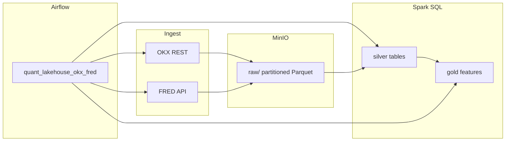

# Quant lakehouse (personal) — OKX + FRED, MinIO, Hive DDL, Spark SQL, Airflow

Batch pipeline for **real** public market data (OKX candles) and **real** macro series (FRED, e.g. VIX). Data lands in **MinIO** (S3-compatible), transforms run as **Spark SQL**, orchestration is **Apache Airflow**. **Hive-compatible DDL** lives under `hive/ddl/` for external tables (run on a cluster with Hive + S3A, or adapt paths).

**Not** investment advice; **personal / portfolio** use only.

## What it does

1. **Ingest** — `scripts/ingest_okx.py` pulls public OKX `market/candles` (e.g. `BTC-USDT`, daily). `scripts/ingest_fred.py` pulls FRED observations (default `VIXCLS`) with your **free API key**.
2. **Lake** — Parquet files under partitioned prefixes, e.g. `raw/okx/inst_id=BTC-USDT/dt=2026-04-10/`. Partition keys are **only in the path** (clean for Hive `EXTERNAL` + `MSCK REPAIR`).
3. **Spark SQL** — Builds `silver/okx_daily`, `silver/fred_daily`, and `gold/btc_vix_daily` (BTC log returns, 20-day rolling stdev of log returns, joined to VIX).
4. **Airflow** — DAG `quant_lakehouse_okx_fred` wires ingest → silver → gold → QC row counts.
5. **Hive** — `hive/ddl/*.hql` documents **external** tables pointing at the same `s3a://quant-lake/...` layout (swap endpoint/credentials for your environment).

## Flow



## Quick start (Docker)

**Prerequisites:** Docker Compose v2, ~8GB+ RAM free, a [FRED API key](https://fred.stlouisfed.org/docs/api/api_key.html).

1. Copy env template and set secrets:

   ```bash
   cd quant-lakehouse
   cp .env.example .env
   # Edit .env: FRED_API_KEY=... (optional: AIRFLOW__CORE__FERNET_KEY)
   ```

2. On Linux/macOS, match host user id for volume mounts (optional but avoids permission noise):

   ```bash
   export AIRFLOW_UID=$(id -u)
   ```

3. Build and start:

   ```bash
   docker compose build
   docker compose up -d
   ```

4. Open **Airflow UI:** [http://localhost:8080](http://localhost:8080) — `admin` / `admin` (change in production).

5. **MinIO console:** [http://localhost:9001](http://localhost:9001) — user/pass default `minio` / `minio12345` (override via `.env`).

6. In Airflow, open DAG **`quant_lakehouse_okx_fred`**:
   - If the toggle shows **Paused**, click it so the DAG is **On**.
   - Click **Trigger DAG** (play button on the right).  
     **Important:** `docker compose up` only starts containers — it does **not** load MinIO. The bucket **`quant-lake`** is created on the first successful ingest. With a **`@daily` schedule**, Airflow may not run anything until the **next** schedule tick unless you trigger manually.

7. After a minute, refresh MinIO → bucket **`quant-lake`** → prefixes **`raw/`**, **`silver/`**, **`gold/`**.

### “MinIO is empty” / “Airflow has no data”

| Symptom | What’s going on |
|--------|------------------|
| MinIO shows no buckets | No ingest has succeeded yet. Airflow doesn’t write to MinIO until **`ingest_okx`** / **`ingest_fred`** run. |
| DAG is paused | Turn the **pause** toggle **off** (or set `AIRFLOW__CORE__DAGS_ARE_PAUSED_AT_CREATION=false` in compose — already set for this project after `compose up` picks up the change). |
| Waiting for schedule | **`@daily`** won’t necessarily run immediately. Use **Trigger DAG**. |
| `ingest_fred` fails / **Up For Retry** | Almost always **missing `FRED_API_KEY`** in `.env` or containers not recreated after editing `.env`. Fix the key, run `docker compose up -d`, clear failed task or trigger a new DAG run. |
| **`spark_silver_*` Up For Retry** | If **`docker compose build --no-cache` failed** on Apple Silicon (log shows `java-17-openjdk-amd64 missing` but only `...-arm64` exists), you were still running an **old image** after `up -d`. The Dockerfile now sets **`JAVA_HOME=/opt/java/current`** via a symlink to the real JDK — run **`docker compose build`** until it **finishes without ERROR**, then **`docker compose up -d`**. Also confirm **`ingest_okx`** succeeded so `raw/okx` exists in MinIO. |
| Wrong MinIO login | Use the same **`MINIO_ROOT_USER` / `MINIO_ROOT_PASSWORD`** as in `.env` (defaults `minio` / `minio12345`). |

To see errors: Airflow UI → DAG → failed task → **Log**.

### Bucket name

Compose defaults `S3_BUCKET=quant-lake`. Spark SQL under `spark/sql/` uses `s3a://quant-lake/...`. If you change the bucket, update those paths (or add templating).

### Hive DDL on a real cluster

After partitions exist:

```sql
MSCK REPAIR TABLE quant_raw.okx_candles;
MSCK REPAIR TABLE quant_raw.fred_observations;
```

Run the statements in `hive/ddl/` with your Hive / Beeline client and S3A config.

## Layout

| Path | Role |
|------|------|
| `dags/quant_lakehouse_dag.py` | Airflow DAG |
| `scripts/ingest_*.py` | OKX + FRED → MinIO |
| `scripts/run_spark_sql.sh` | `spark-sql` with S3A → MinIO |
| `spark/sql/*.sql` | Silver / gold / QC |
| `hive/ddl/*.hql` | External table DDL (portfolio + EMR-style runs) |

## License / data

- OKX and FRED data are subject to their respective terms; **do not redistribute** bulk downloads from this project. This repo holds **code and configs** only.
